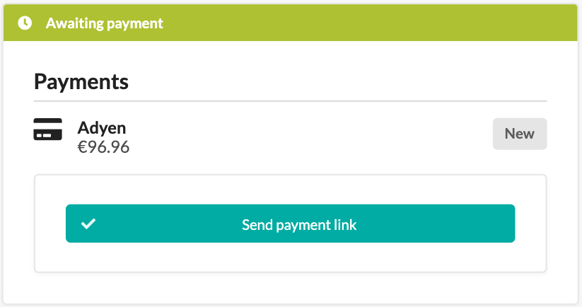
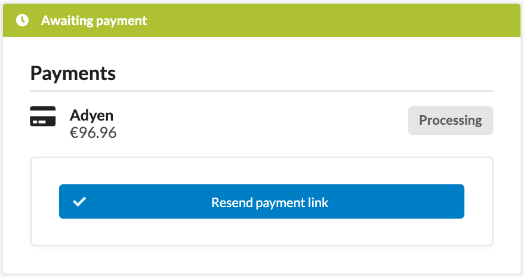

# PayByLink

The [PayByLink](https://docs.adyen.com/unified-commerce/pay-by-link/) feature allows you to create a payment link that can be shared with customers to facilitate easy and quick payments.
This feature is particularly useful for businesses that want to streamline the payment process without requiring customers to navigate through a full checkout process.

## Prerequisites:
To use the functionality, you need to have a placed order using the Adyen payment method, but not yet paid.

## Creating a Payment Link:

1. Navigate to the Order's details page in your Sylius admin panel.
2. Locate the "Send payment link" button for the payment and click on it.
    

        
    

3. You will be informed that a payment link has been generated successfully and sent to the customer.
4. The payment state will transition to "Processing" state, the state will get updated accordingly based on further webhooks from Adyen.

## Processing the Payment Link:

1. The customer will receive an email containing the payment link.
2. When the customer clicks on the link, they will be redirected to a secure payment page hosted by Adyen.
3. The customer can then complete the payment using their preferred payment method.
4. Once the payment is successful, the order status in Sylius will be updated accordingly.

## Expired links:

In cases when the customer did not complete the payment within the validity period of the link and the link expired, the administrator can generate a new payment link by clicking the resend button.
    

        
    

The customer will then receive a new email with the new payment link.

In cases when a link gets regenerated before the previous one expires, the old link will be invalidated and only the most recently generated link will be valid for payment. 

## Troubleshooting:

In cases when a link could not be generated, the administrator will be informed about the failure and no email will be sent. 
To further investigate the issue, please check the logs for more details.
